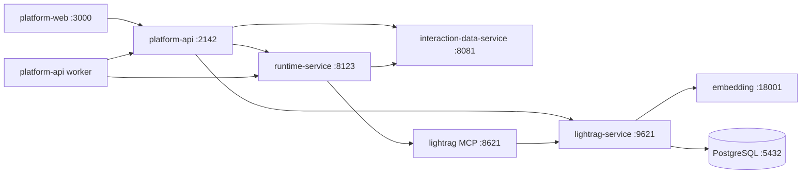

# 本地服务启动与停止

文档类型：`Operational`（仓库级 supporting doc）
状态：Current

本文是本地手启、停止和依赖对照手册。默认本地部署的服务成员、端口和主链以
[`docs/local-deployment-contract.yaml`](./local-deployment-contract.yaml) 为准；
摘要入口见 [`docs/local-dev.md`](./local-dev.md)。配置键名索引见
[`docs/env-matrix.md`](./env-matrix.md)。

Windows 本机建议按本文逐服务启动。Git Bash 可用根脚本 `scripts/dev-up.sh` /
`scripts/dev-down.sh`，但它不会拉起本文中的本地 embedding sidecar。

不要把本机绝对路径写进配置或提交。工作目录一律使用仓库相对路径。

## 1. 服务清单

| 服务 | 端口 | 是否默认本地集 | 作用 |
| --- | --- | --- | --- |
| `runtime-service` | 8123 | 是 | LangGraph 执行层：对话、Testcase Agent、SQL Agent |
| `interaction-data-service` | 8081 | 是 | 结果域落库 |
| `lightrag-service` HTTP | 9621 | 是 | 知识文档、检索、知识图谱 |
| `lightrag-service` MCP | 8621 | 是 | runtime 通过 MCP 查项目知识 |
| `platform-api` | 2142 | 是 | 控制面：登录、权限、知识代理、图谱目录 |
| `platform-api worker` | 无 | 配套必需 | 异步 operation。刷新 Graphs 目录必须有它 |
| `platform-web` | 3000 | 是 | 正式控制台前端 |
| 本地 embedding sidecar | 18001 | 可选 | 当前本机 LightRAG 使用的 OpenAI 兼容 embedding |
| 本机 PostgreSQL | 5432 | 可选 | 仅当 LightRAG 配置了 `PGKVStorage` / `PGVectorStorage` |
| `runtime-web` | 3001 | 否 | 可选 runtime 调试壳，不是产品入口 |

当前本机知识链路若使用 `BAAI/bge-small-zh-v1.5`，需要额外启动
`apps/lightrag-service/local_bge_embed_server.py`。未配置该 sidecar 时，把
`apps/lightrag-service/.env` 的 embedding 改回可用的远程模型即可。

## 2. 依赖与调用链



| 链路 | 路径 |
| --- | --- |
| 平台主链 | `platform-web -> platform-api -> runtime-service` |
| 结果域 | `platform-api / runtime-service -> interaction-data-service` |
| 知识控制面 | `platform-web -> platform-api -> lightrag-service :9621` |
| Agent 查知识 | `runtime-service -> LightRAG MCP :8621` |
| Graphs 目录刷新 | `platform-web -> platform-api -> worker -> runtime-service` |

不要把 **Graphs**（runtime 图谱目录，如 `test_case_agent`）和 **知识图谱**
（LightRAG 实体关系图）当成同一页。前者空目录通常是 worker 没起；后者才跟文档入库有关。

## 3. 启动前检查

1. 安装 `uv`、Python 3.13（`runtime-service` / `platform-api`）以及 Node 22 + pnpm。
   LightRAG 当前本机手启使用 Python 3.12 以避免部分依赖在 3.13 上编译失败。
2. 根目录没有统一 `.env`。只改各 app 自己的配置文件。
3. `platform-api` 与 `runtime-service` 的
   `PLATFORM_RUNTIME_DELEGATION_SECRET`、`PLATFORM_RUNTIME_MANAGEMENT_API_KEY` 必须一致。
4. `runtime-service` 的 `MODEL_ID` 建议留空，由 `settings.yaml` /
   `settings.local.yaml` 的 `default_model_id` 决定。附件解析模型看
   `.env` 里的 `MULTIMODAL_PARSER_MODEL_ID`，对应模型组必须四元组齐全：
   `model_provider` / `model` / `base_url` / `api_key`。
5. 改完 `settings*.yaml` 后必须重启 `runtime-service`。配置在进程启动时加载一次。

## 4. 推荐启动顺序

1. 本机 PostgreSQL（仅 LightRAG 走 PG 存储时）
2. 本地 embedding sidecar（仅 LightRAG 指向 `127.0.0.1:18001` 时）
3. `runtime-service`
4. `interaction-data-service`
5. `lightrag-service` HTTP + MCP
6. `platform-api`
7. `platform-api worker`
8. `platform-web`

Git Bash 一键（不含本地 embedding sidecar）：

```bash
bash scripts/dev-up.sh
bash scripts/check-health.sh
```

## 5. 逐服务启动

以下命令默认已把 `uv` / `pnpm` 放进 `PATH`。PowerShell 示例：

```powershell
$env:Path = "$env:APPDATA\Python\Python314\Scripts;$env:USERPROFILE\.local\bin;" + $env:Path
$env:PYTHONUTF8 = "1"
```

### 5.1 本地 embedding sidecar（可选）

```powershell
Set-Location apps/lightrag-service
uv run --python 3.12 python local_bge_embed_server.py
```

健康检查：`http://127.0.0.1:18001/health`

### 5.2 `runtime-service`

```powershell
Set-Location apps/runtime-service
uv run langgraph dev --config runtime_service/langgraph.json --port 8123 --no-browser --allow-blocking
```

`--allow-blocking` 是当前 `test_case_agent` / Deep Agents 本地调试所需。

健康检查：

- `http://127.0.0.1:8123/info`
- `http://127.0.0.1:8123/internal/capabilities/models`

配置：

- `apps/runtime-service/runtime_service/.env`
- `apps/runtime-service/runtime_service/conf/settings.yaml`
- `apps/runtime-service/runtime_service/conf/settings.local.yaml`

### 5.3 `interaction-data-service`

```powershell
Set-Location apps/interaction-data-service
uv run uvicorn main:app --host 127.0.0.1 --port 8081 --reload
```

健康检查：`http://127.0.0.1:8081/_service/health`

配置：`apps/interaction-data-service/.env`

### 5.4 `lightrag-service` HTTP

```powershell
Set-Location apps/lightrag-service
$env:WORKING_DIR = "$PWD\data\rag_storage"
$env:INPUT_DIR = "$PWD\data\inputs"
uv run --python 3.12 lightrag-server
```

健康检查：`http://127.0.0.1:9621/health`

配置：`apps/lightrag-service/.env`

当前本机若使用 PostgreSQL 向量库，需要本机 Postgres 已创建对应数据库，且
`.env` 里的 `POSTGRES_*`、`LIGHTRAG_VECTOR_STORAGE` 与 embedding 维度匹配。
Windows 上 pgvector HNSW 维度上限是 2000。图谱存储缺 AGE 扩展时，把
`LIGHTRAG_GRAPH_STORAGE` 保持为 `NetworkXStorage`。

检索词最短长度当前为 1 个字符，允许中文短词如「报销」。

### 5.5 `lightrag-service` MCP

```powershell
Set-Location apps/lightrag-service
$env:WORKING_DIR = "$PWD\data\rag_storage"
$env:INPUT_DIR = "$PWD\data\inputs"
$env:MCP_TRANSPORT = "sse"
$env:MCP_HOST = "127.0.0.1"
$env:MCP_PORT = "8621"
$env:MCP_PATH = "/sse"
$env:MCP_MESSAGE_PATH = "/messages/"
uv run --python 3.12 --with "fastmcp>=3.2.0" --with "starlette==0.49.1" python -m lightrag.mcp
```

健康口径：端口 `8621` 处于 LISTEN。`/sse` 是长连接，浏览器打开会一直挂起，这是正常现象。

Git Bash 也可用 `bash scripts/lightrag-service-up.sh` 同时拉起 HTTP 和 MCP。

### 5.6 `platform-api`

```powershell
Set-Location apps/platform-api
uv run uvicorn main:app --host 127.0.0.1 --port 2142 --reload
```

健康检查：

- `http://127.0.0.1:2142/_system/health`
- `http://127.0.0.1:2142/api/langgraph/info`

配置：`apps/platform-api/.env`

本地演示账号来自该文件的 bootstrap 配置，不是生产账号。

### 5.7 `platform-api worker`

```powershell
Set-Location apps/platform-api
uv run python worker.py
```

没有 HTTP 端口。Graphs 页点「刷新目录」会提交 `runtime.graphs.refresh`；
worker 不在时任务会一直停在 `submitted`，目录表为空。

### 5.8 `platform-web`

```powershell
Set-Location apps/platform-web
pnpm dev -- --host 127.0.0.1 --port 3000
```

访问：`http://127.0.0.1:3000`

配置：`apps/platform-web/.env.local`

### 5.9 `runtime-web`（可选）

```powershell
Set-Location apps/runtime-web
$env:PORT = "3001"
pnpm dev
```

必须直连 `http://localhost:8123`，不要指到控制面地址。

## 6. 停止

建议逆序：前端 → worker → 控制面 → LightRAG → runtime / 结果域 → embedding。
本机 PostgreSQL 通常保持运行。

Git Bash：

```bash
bash scripts/dev-down.sh
```

该脚本不会停止本机 PostgreSQL，也不会停止 `local_bge_embed_server.py`。

PowerShell 按端口停：

```powershell
function Stop-ListenPort([int]$Port) {
  Get-NetTCPConnection -LocalPort $Port -State Listen -ErrorAction SilentlyContinue |
    ForEach-Object { Stop-Process -Id $_.OwningProcess -Force -ErrorAction SilentlyContinue }
}

Stop-ListenPort 3000
Stop-ListenPort 3001
Stop-ListenPort 2142
Stop-ListenPort 8123
Stop-ListenPort 8081
Stop-ListenPort 9621
Stop-ListenPort 8621
Stop-ListenPort 18001

Get-CimInstance Win32_Process |
  Where-Object { $_.CommandLine -match 'worker\.py' } |
  ForEach-Object { Stop-Process -Id $_.ProcessId -Force -ErrorAction SilentlyContinue }
```

LangGraph 可能留下 multiprocessing 子进程继续占 `8123`。如果 `Stop-ListenPort 8123`
后端口仍在 LISTEN，再查一次该端口的 `OwningProcess` 及其子进程并结束。

## 7. 健康检查

| 服务 | 检查 |
| --- | --- |
| `platform-web` | `http://127.0.0.1:3000` 返回页面 |
| `platform-api` | `GET http://127.0.0.1:2142/_system/health` → 200 |
| `interaction-data-service` | `GET http://127.0.0.1:8081/_service/health` → 200 |
| `runtime-service` | `GET http://127.0.0.1:8123/info` → 200 |
| `lightrag-service` | `GET http://127.0.0.1:9621/health` → 200 |
| 本地 embedding | `GET http://127.0.0.1:18001/health` → 200 |
| LightRAG MCP | `8621` LISTEN |
| worker | `platform-api/.data/platform-api.db` 中 `runtime.graphs.refresh` 能从 `submitted` 变成 `succeeded` |

## 8. 配置文件

| 服务 | 文件 |
| --- | --- |
| `runtime-service` | `apps/runtime-service/runtime_service/.env`、`conf/settings.yaml`、`conf/settings.local.yaml` |
| `platform-api` | `apps/platform-api/.env` |
| `interaction-data-service` | `apps/interaction-data-service/.env` |
| `lightrag-service` | `apps/lightrag-service/.env` |
| `platform-web` | `apps/platform-web/.env.local` |
| `runtime-web` | `apps/runtime-web/.env` |

真实 `api_key` 放 `settings.local.yaml` 或各 app `.env`，不要提交到 git。
`settings.yaml` / `settings.local.yaml` 已被 `runtime-service` gitignore。

## 9. 常见问题

| 现象 | 原因 | 处理 |
| --- | --- | --- |
| Graphs 页没有目录 | worker 未启动，刷新任务停在 `submitted` | 启动 `uv run python worker.py`，再刷新目录或刷新浏览器 |
| 知识检索 422，短中文词失败 | LightRAG `/query` 曾要求至少 3 个字符 | 当前最短长度为 1；仍失败时看 `lightrag.log` |
| `doubao_vision_mini` config incomplete | runtime 在旧进程里加载了没有该模型组的配置 | 补齐 `settings.local.yaml` 后重启 `runtime-service` |
| 文档解析走视觉模型失败 | `MULTIMODAL_PARSER_MODEL_ID` 指向的模型组缺字段 | 补四元组并重启 runtime |
| LightRAG embedding 404 / ModelNotOpen | 远程 embedding 未开通或模型 ID 不正确 | 改用本地 `18001` sidecar，或换成已开通的 embedding 模型 ID |
| 改完 yaml 页面仍报旧错 | settings 在 import 时加载一次 | 重启占用 `8123` 的全部进程后再启动 |

## 10. 权威边界

- 默认本地成员、端口、主链：`docs/local-deployment-contract.yaml`
- 配置键名：`docs/env-matrix.md`
- 容器部署：`docs/deployment-guide.md`、`deploy/README.md`
- 本文只覆盖宿主机手启。它不能覆盖 contract 或 leaf standard。
